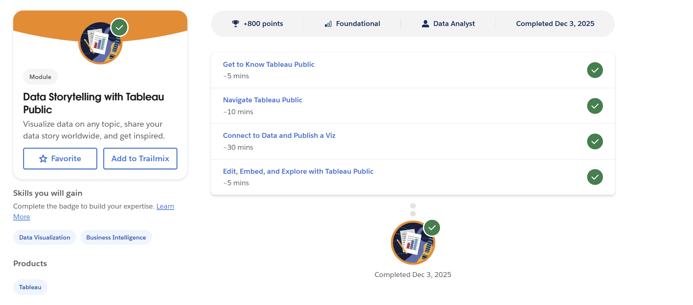
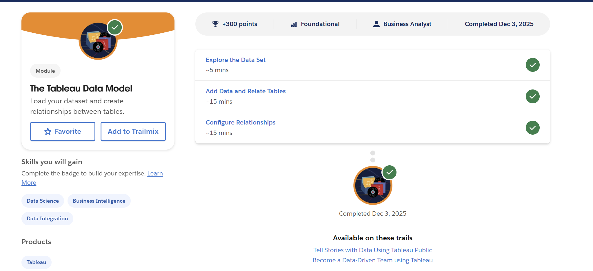
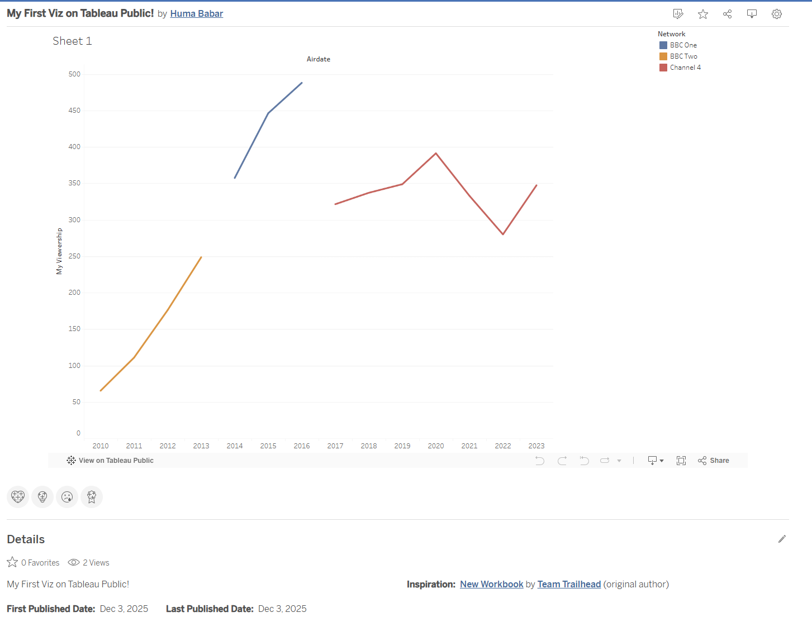

# Assignment: Tableau Trailhead Modules & Data Storytelling Viz
## Overview
Complete two Tableau Trailhead modules asynchronously and submit proof of completion plus a simple Tableau Public visualization via GitHub.

[Link to Tableau Public viz](https://public.tableau.com/views/MyFirstVizonTableauPublic_17648063780250/Sheet1?:language=en-US&:sid=&:display_count=n&:origin=viz_share_link) 

### Completion of Data Storytelling with Tableau Public Badge 

### Completion of The Tableau Data Model Badge 

### My Tableau Public viz 

#### Written Reflection 

One thing I learned from the Data Storytelling module is that Tableau is for anyone who enjoys working with data, not just analysts, and it can be used for work, school, or even for fun! Because of that, visualizations should be simple, clear, and easy for anyone to understand since this can be publically accessed. I also learned that you can choose to display the number of each item in a visualization or remove it (as I did in my public viz) to keep the view neat and concise. A major concept from the Tableau data model that I learned is the difference between relationships and joins, and how relationships allow tables to stay connected without altering the data. In healthcare, Tableau could be used to clearly show patterns like whether patients miss appointments based on how many lab tests they have scheduled, helping clinics improve scheduling and follow-up care.